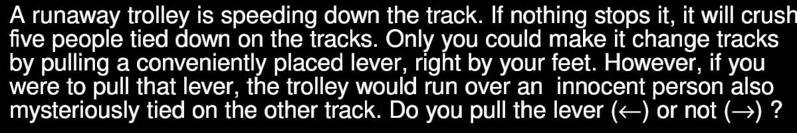

# Trolley problem (and consequences)

Author: Matteo (mjeulin)

Design: This game is an interactive and consequence focused take on the classic trolley problem, blending morality and guilt.

Text Drawing: The story is parsed from a text file and stored as an array of states. The whole story is a graph. Text is rendered at runtime and each glyph is stored in a map to avoid re-rendering already rendered characters. 

Choices: Choices affect the general outcome of the story in a binary tree-like manner (each situation has two possible outcomes). This is just a choice for my story however and my parsing method allows there to be an arbitrary amount of choices per situation and choices can also loop back to previous states (like in a graph). This is done by parsing a text file before run-time and generating a graph of the story. This system does not support conditional branching however. Supporting more than two choices per situation would also require to add mappings to different keyboard keys. 

Screen Shot:

How To Play:

Choose between the different choices by pressing the arrow keys (left or right). You can also reset by pressing R.

Sources: I used the freesans font from https://fontmeme.com/fonts/freesans-font/ (a public domain font)

This game was built with [NEST](NEST.md).

